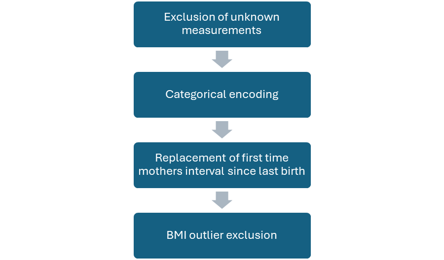
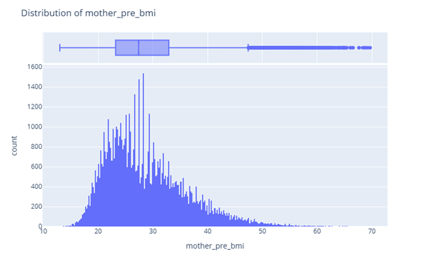
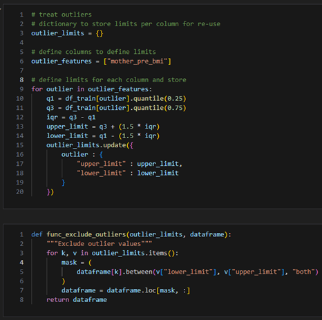
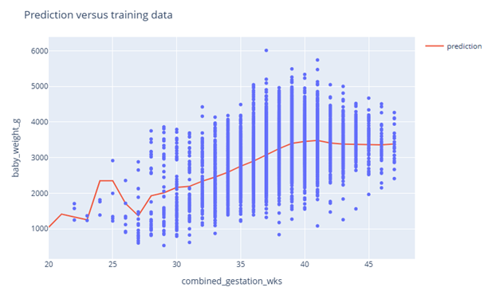
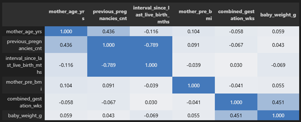

# Data Science Project

## Executive Summary

Recently learning I was to become an uncle, I decided to develop my own predicted due date and birth weight to explore whether this was feasible with public datasets and open-source tools as well as deepen my knowledge in the area.

My hypothesis was that the mother’s age, body mass index (BMI), time since last birth, number of previous births, tobacco use and previous preterm births would affect both the due date and birth weight. I searched public health agencies and data science websites, such as Kaggle, for a suitable dataset, choosing the 2024 live births dataset from the US’ National Center for Health Statistics (Data Access - Vital Statistics Online 2025).

The dataset was sampled and cleansed using the associated user guide to understand the coding conventions used for each of the features. Additional features were engineered and outliers treated. Summary and correlation statistics, including the Pearson rho values, were analysed to determine which independent variables were finally used in the model.

Both linear and random forest regressors were used and evaluated on their root mean square error (RMSE) and R-squared values. Only a birth weight prediction based on gestation duration was progressed due to very weak correlation between the other independent variables and gestation duration.
The strongest model was a random forest with the smallest RMSE (476) and largest R2 (0.25). This predicted a birth weight of 3,399g with an effective error of ±14%.

Overall, I concluded that the originally identified independent variables cannot predict due date. There is too much variation in the data to determine relationships. A notable factor is that gestation duration is inherently hard to measure with the last menstrual period method found to have a variation of 7 days (Nakling et al., 2005). In addition, it was confirmed that the dataset rounds incomplete weeks down (Ondrej, 2017).

Future improvements could include finding datasets including ultrasound measurements at key stages to improve predictive power.

## Data Infrastructure & Tools

As a public project open-source tools were selected to enable anyone to replicate and expand on the work. The tools selected included:

* Jupyter notebooks as it can display code, results and commentary together to help others understand the approach and implementation taken in this project.
* Python as it is widely used for data science and easy to read.
* Pandas to store and manipulate data, however a limitation is that it processes data in series by default. The chosen dataset is 3.6 million rows which could lead to long load and processing times and may require subsequent decisions on compute power, parallelism and data sampling.
* Scikit learn was selected for the regression models due to its inclusion of core models and evaluation metrics along with consistent structure when coding.
* GitHub for the repository hosting as it supports public access. However, it limits file sizes to 100MB and is not designed for data storage. As a result, the source data could not be uploaded and instead a sample file was included.
* Lastly, cookiecutter was used to create the repository structure through the data science template to support ease of navigation and reuse.

## Data Engineering

The data was structured in a fixed width text file; this was parsed using the specification found in the user guide. As the file contained 3,638,436 rows and 294 columns, to manage memory only the first 100,000 rows and target columns were selected but this still provides sufficient data to predict with.
The data was split into a training and test set to prevent overfitting and enable model evaluation. Training data was prepared and cleansed following the steps in figure 1.

Figure 1: Data preparation steps.

### Exclusion of records with an unknown measurement

Some records had unknown values for one of more of the features where measurement was not possible. These made up only 4.2% of records and it was decided to build a model that would require this data and so these records were excluded.

### Categorial encoding

Previous preterm birth and overall tobacco use was stored as a categorial value. Linear regression requires numeric data and as such this column was encoded using the pandas.get_dummies method.

### Previous pregnancies and interval since last birth

Previous pregnancies counted the birth of the record, meaning if the birth was the mother’s first they were recorded as having one previous birth. In addition, first time mothers had a not applicable value encoded for their record. It was decided to exclude records with unknown interval for non-first mothers and for first-time mother to replace the unknown value with the age of the mother.

### BMI

Figure 2: Distribution of BMI.

Figure 3: Code to identify outlier records and exclude.

As per figure 2 BMI was normally distribution with a long tail of high values. The data sampled only American mothers, and America has some of the highest obesity in the world (Phelps, Nowell H et al. 2024). As the predictions are to be agnostic of country and my sister non-American, I decided to exclude records above the upper limit as seen in figure 3. This potentially could make the model less reliable for American predictions but more generally reliable for other populations.

## Data Visualisation & Dashboards

Plotly was used to create visuals as it is easy to use and provides interactivity that is helpful when exploring data, such as the ability to zoom into a specific area or include and exclude categories.

Histograms with box plots in the margins were generated for each feature to understand the distribution, determine outliers and whether any transformation was required to support the selected regressors. Heatmaps for the correlation coefficients were used as they intuitively highlight for less technical users where values are high and low so, in this context, whether they are correlated or not.

All visuals were labelled with explanatory titles, clear axis and units to ensure correct interpretation.

## Data Analytics

Data was sourced from the 2024 live births dataset provided by US’ National Center for Health Statistics. This provided a huge dataset with clear and transparent documentation, in the user guide, of definitions and collection practices. In addition, the data was already anonymised of any personally identifiable information and the user agreement allows use for research and statistical analysis, (Data user agreement 2024), addressing any data privacy and licensing concerns I had.

|Source Name|Feature Name|Type|
|-|-|-|
|MAGER|mother_age_yrs|Numeric|
|TBO_REC|previous_pregnancies_cnt|Numeric|
|ILLB_R|interval_since_last_live_birth_mths|Numeric|
|CIG_0|cigarettes_pre_daily_cnt|Numeric|
|CIG_1|cigarettes_1st_daily_cnt|Numeric|
|CIG_2|cigarettes_2nd_daily_cnt|Numeric|
|CIG_3|cigarettes_3rd_daily_cnt|Numeric|
|CIG_REC|is_smoker|Categorical|
|BMI|mother_pre_bmi|Numeric|
|RF_PPTERM|previous_pre_term_birth|Categorical|

Table 1: Data dictionary.

Pearson and Spearman correlation statistics were conducted for the corresponding linear and non-linear features. This was run to initially screen independent variables for suitably and check for multicollinearity between independent variables. Multicollinearity can distort linear regression models by over-weighting the effects of the affected variables.

The correlation coefficients identified that only one independent variable had a notable impact on baby weight. It was decided to run three models and compare the RMSE and R2:

1. A linear regressor using that single independent variable
2. A random forest regressor using that single independent variable
3. A random forest regressor using all the independent variables

Options 2 &3 were selected for random forests capability for handling outlier values and non-linear relationships.

|Model|Independent Variables|RMSE|R-squared|
|-|-|-|-|
|Linear|1|489.91|0.21|
|Random Forest|8|501.91|0.17|
|Random Forest|1|476.05|0.25|

Table 2: Model scoring metrics.

Figure 4: Random forest prediction overlaid on training data.

From table 2, we see that a random forest regressor using gestation duration was the best predictor with the smallest RMSE and R2. While the R2 value is much lower than typically desired, the context of figure 4 shows that it does appear to follow the trend despite the spread in the data.

The random forest model using all independent variables also confirms that there is no relationship as the RMSE and R2 are the worst scoring.

## Appendix

### References

Data Access - Vital Statistics Online (2025) Centers for Disease Control and Prevention. Available at: [https://www.cdc.gov/nchs/data_access/VitalStatsOnline](https://www.cdc.gov/nchs/data_access/VitalStatsOnline).htm#Births (Accessed: 26 August 2025).

Data user agreement (2024) Centers for Disease Control and Prevention. Available at: [https://www.cdc.gov/nchs/policy/data-user-agreement.html](https://www.cdc.gov/nchs/policy/data-user-agreement.html) (Accessed: 27 August 2025).

Nakling, J., Buhaug, H. and Backe, B. (2005) ‘The biologic error in gestational length related to the use of the first day of last menstrual period as a proxy for the start of pregnancy’, Early Human Development, 81(10), pp. 833–839. doi:10.1016/j.earlhumdev.2005.06.004.

Ondrej, J. (2017) Pregnancy duration, Kaggle. Available at: [https://www.cdc.gov/nchs/policy/data-user-agreement.html](https://www.kaggle.com/discussions/general/34523) (Accessed: 26 August 2025).

Phelps, Nowell H et al. (2024) ‘Worldwide trends in underweight and obesity from 1990 to 2022: a pooled analysis of 3663 population-representative studies with 222 million children, adolescents, and adults’, The Lancet, Volume 403, Issue 10431, 1027 – 1050

### Supporting Material

Pearson correlation heatmap of linear variables.
